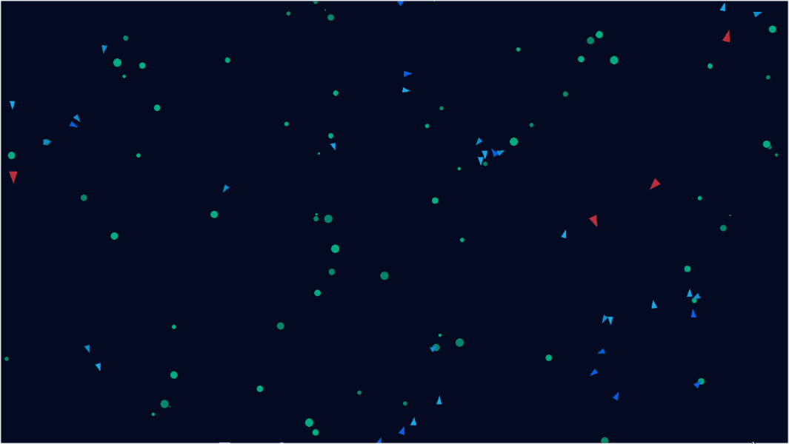

# The Life Aquatic

Python study project: ecosystem simulation with flocking behavior.

Powered by Tkinter and NumPy modules



### Features

- Growing and reproducing flora
- Flora-eating, flocking and reproducing boids
- Boid-eating, randomly roaming and reproducing predators

### Usage

Run the simulation using:
```
py main.py
```

Profile the simulation and display basic results using:
```
profile_app.bat
py profile_pstats.py
```

### License

This application is released under the *MIT License*.
